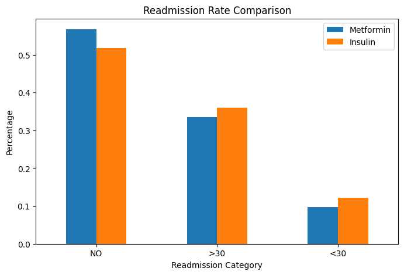
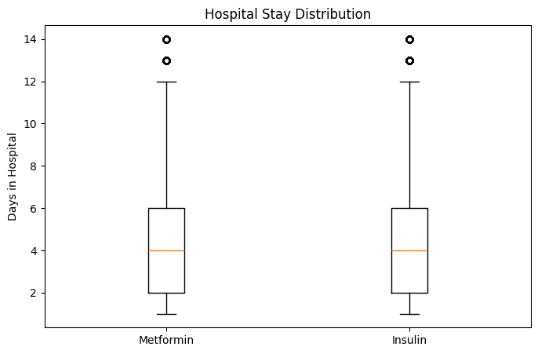

# 📊 Real-World Evidence (RWE) Drug Effectiveness Study

## Overview

This project evaluates the comparative effectiveness of Metformin and Insulin using real-world hospital patient data.

Using healthcare analytics and statistical methods, I analyzed treatment cohorts to identify differences in readmission outcomes and healthcare utilization patterns.

---

## Business Question

Can real-world hospital data be used to identify differences in patient outcomes between Metformin-treated and Insulin-treated cohorts?

---

## Dataset

**Dataset:** Diabetes 130-US Hospitals for Years 1999–2008

**Source:** UCI Machine Learning Repository

**Records:** 100,000+ patient encounters

**Hospitals:** 130 US hospitals

---

## Tools & Technologies

- Python
- Pandas
- Matplotlib
- SciPy
- Jupyter Notebook
- VS Code
- Git & GitHub

---

## Project Workflow

### 1. Data Understanding
- Reviewed patient encounter data
- Explored medication variables
- Investigated readmission outcomes

### 2. Cohort Creation
- Metformin cohort
- Insulin cohort

### 3. Outcome Analysis
- Readmission rate comparison
- Hospital stay analysis
- Medication burden evaluation

### 4. Statistical Testing
- Chi-square Test
- Independent T-Test

### 5. Visualization
- Readmission comparison chart
- Hospital stay distribution boxplot

---

## Key Findings

- Treatment cohorts demonstrated different readmission patterns.
- Insulin-treated patients showed longer average hospital stays.
- Statistical analysis suggested meaningful differences in healthcare utilization.
- Real-world healthcare data can provide valuable evidence for treatment outcome evaluation.

---

## Visualizations

### Readmission Rate Comparison

### Hospital Stay Distribution

---

## Repository Structure

├── data/

├── notebooks/

├── visuals/

└── README.md

---

## Skills Demonstrated

- Healthcare Analytics
- Real-World Evidence (RWE)
- Cohort Analysis
- Statistical Testing
- Data Visualization
- Clinical Data Interpretation
- Python Programming

---

## Author

Dharma Reddy Padala

Healthcare Analytics | Clinical Data Analytics | Healthcare Informatics
